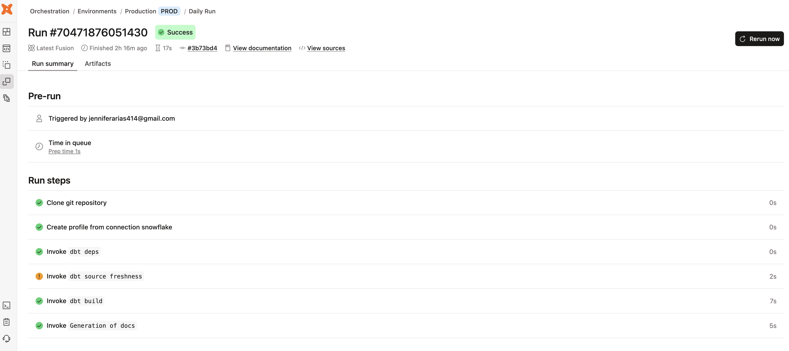
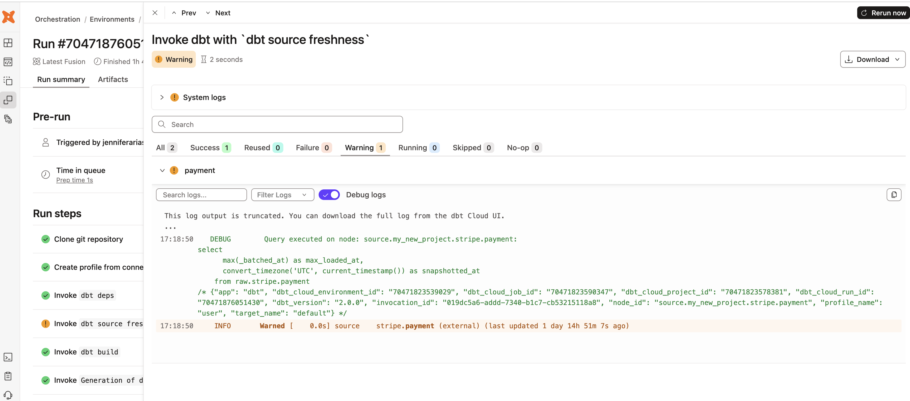

## dbt Jaffle Shop Project

### Overview

This project demonstrates an end-to-end analytics engineering workflow using dbt and Snowflake. It models raw transactional data into analytics-ready tables while incorporating data quality testing, source monitoring, and automated deployment.

---

### Architecture

The project follows a layered dbt design pattern:

* **Staging Layer**

  * Cleans and standardizes raw source data
  * Renames fields for consistency and clarity
  * Establishes a reliable foundation for downstream models

* **Marts Layer**

  * Applies business logic and transformations
  * Produces analytics-ready fact and dimension tables

---

### Data Sources

* `raw.jaffle_shop` (customers, orders)
* `raw.stripe` (payment)

Sources are configured using dbt `source()` and monitored with **source freshness checks**.

---

### Models

#### Staging

* `stg_jaffle_shop__customers`
* `stg_jaffle_shop__orders`
* `stg_stripe__payment`

#### Marts

* `dim_customers`
* `fct_orders`

---

### Key Features

* **Modular transformations**

  * Built using dbt models and CTE patterns

* **DAG-based pipeline**

  * Managed using `ref()` and `source()` dependencies

* **Data quality testing**

  * Generic tests:

    * `unique`, `not_null` (primary keys)
    * `accepted_values` (order status)
    * `relationships` (foreign key integrity)
  * Singular test:

    * Ensures total payments per order are non-negative

* **Source freshness monitoring**

  * Detects stale upstream data using `loaded_at_field`

* **Documentation**

  * Model, column, and source descriptions defined in YAML
  * Custom doc blocks for business definitions

* **Multi-source integration**

  * Combines Jaffle Shop transactional data with Stripe payments

---

### Data Flow

Raw Snowflake tables  
→ Staging models (cleaning & standardization)  
→ Mart models (business logic & aggregations)

---

### Deployment

The project is deployed using **dbt Cloud** with a Production environment and scheduled job.

**Job configuration:**

- Runs source freshness checks (`dbt source freshness`)
- Executes full pipeline using `dbt build`
- Automatically generates documentation on run

This setup reflects a typical production workflow where data pipelines are automatically executed, validated, and documented on a recurring schedule.

---

### dbt Cloud Job Run

Example production job run showing pipeline execution and results:



---

### Source Freshness Monitoring

Example of freshness check identifying stale upstream data:



---

### Technologies Used

* dbt
* dbt Cloud
* Snowflake
* SQL
* GitHub

---

### How to Run Locally

Install dependencies:

```bash
dbt deps
```

Run models, tests, and build the pipeline:

```bash
dbt build
```

(Optional) Check source freshness:

```bash
dbt source freshness
```

(Optional) Generate and view documentation:

```bash
dbt docs generate
dbt docs serve
```
